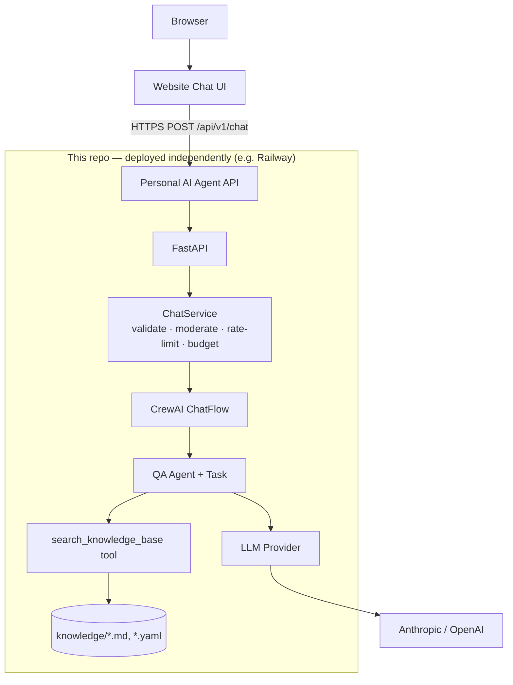

# Personal AI Agent

[](https://github.com/saadamjad/Personal-AI-Agent/actions/workflows/ci.yml)
[](LICENSE)

A personal assistant agent that can act on behalf of any person or owner — answers
questions about their background, grounded in a plain-text knowledge base they write
themselves. Built with **FastAPI** + **CrewAI**, deployable to **Railway** (or any
Docker host), and talked to over HTTPS by a website's chat widget.

This repo runs [saadstack.com](https://saadstack.com)'s chat agent today, but it's not
tied to that identity — clone it, swap in your own background, and it's yours.

## Why this exists

A static site is a one-way pitch. This turns it into something a visitor can actually
question — "do they have React Native experience?", "are they open to contract work?" —
and get an accurate, on-brand answer sourced only from facts you've written down, not
something the model improvised.

## Who it's for

Anyone who wants a small, self-hosted personal assistant that can speak on their behalf,
without wiring up a vector database, a SaaS chatbot platform, or handing an LLM provider
your API key from the browser.

## Architecture

The agent is a **separate service** from the website. The website is a client; it never
runs the agent itself, and it never sees your LLM credentials.



- **The website never talks to Anthropic/OpenAI directly** — only to this service's own
  `/api/v1/chat` endpoint. LLM API keys live only in this service's environment
  (locally in `.env`, in production in your host's environment variable store) and are
  never sent to the browser.
- **This is not multi-tenant SaaS.** Each deployment is independent: you fork this repo,
  add your own credentials and knowledge, and deploy your own instance. There's no user
  accounts, billing, or shared infrastructure.
- Full request lifecycle and the reasoning behind each layer: [ARCHITECTURE.md](ARCHITECTURE.md).

## Features

- CrewAI agent grounded in your own `app/knowledge/*.md` / `*.yaml` files — no vector DB,
  no embeddings, edit-and-redeploy content updates.
- Works with **OpenAI or Anthropic**, chosen via environment variable.
- Regex-based moderation (jailbreak/abuse/greeting/gibberish) short-circuits obvious cases
  before any LLM call — zero cost, zero latency, deterministic.
- Per-session and per-IP rate limiting, plus a persisted daily LLM-call budget as a cost
  backstop independent of rate limiting.
- Conversation history persisted in SQLite (survives redeploys via a mounted volume).
- Structured JSON logging with automatic secret redaction.
- No stack traces or internals ever reach the client — every error is a clean
  `{"error": "..."}` body.
- Ships with tests, ruff, mypy, a Dockerfile, and CI.

## Tech stack

FastAPI · CrewAI · Pydantic / pydantic-settings · SQLite · Uvicorn · Docker · Railway

## Quick start (local dev)

```bash
git clone https://github.com/saadamjad/Personal-AI-Agent.git
cd Personal-AI-Agent
cp .env.example .env        # fill in OPENAI_API_KEY or ANTHROPIC_API_KEY
python3.11 -m venv .venv
source .venv/bin/activate
pip install -e ".[dev]"
uvicorn app.main:app --reload
```

Then verify it's up:

```bash
curl http://localhost:8000/healthz
curl http://localhost:8000/readyz     # confirms knowledge loaded + an LLM key is set
```

Open `http://localhost:8000/docs` for interactive OpenAPI docs, or send a real message:

```bash
curl -X POST http://localhost:8000/api/v1/chat \
  -H "Content-Type: application/json" \
  -d '{"session_id": "'$(python3 -c 'import uuid;print(uuid.uuid4())')'", "message": "What is Saad'\''s experience?"}'
```

## Configuring an AI provider

Set **one** of these in `.env` (see `.env.example` for the full list):

```bash
OPENAI_API_KEY=sk-...
OPENAI_MODEL=gpt-4o-mini

# or

ANTHROPIC_API_KEY=sk-ant-...
ANTHROPIC_MODEL=claude-haiku-4-5
```

If both are set, `CHAT_LLM_PROVIDER=openai` or `anthropic` picks one explicitly;
otherwise OpenAI is preferred automatically. Provider selection is centralized in
`app/core/config.py` (`Settings.resolved_provider`) and consumed in one place,
`app/agents/qa_agent.py`'s `build_llm()` — adding another LiteLLM-supported provider
means editing that one function, nothing else.

There is no embedding provider in this project — the knowledge base is small enough that
`app/knowledge/loader.py` loads every file into memory and the retriever tool does plain
keyword matching (with a safe fallback to "return everything" rather than risk a missed
match). No embedding API key is needed or used.

Full variable reference: [ENVIRONMENT.md](ENVIRONMENT.md).

## Making this your own agent

1. **Replace the knowledge base** — edit or replace the files in `app/knowledge/`
   (`profile.md`, `career_timeline.yaml`, `education.md`, `projects.md`, `skills.md`,
   `hobbies_and_misc.md`). Any `.md`/`.yaml` file you add there is picked up
   automatically — no code changes.
2. **Set your identity** — `AGENT_OWNER_NAME` and `AGENT_CONTACT_EMAIL` in `.env` drive
   the agent's system prompt and its fallback reply. No other source file references a
   name.
3. **Set your own LLM credentials** — see above.
4. **(Optional) Tune behavior** — `app/prompts/system_prompt.py` holds the agent's
   personality, scope boundary, and accuracy rules if you want to change tone or add
   ground rules beyond what's swapped in by `AGENT_OWNER_NAME`.
5. **Deploy your own instance** and point your own website at it (see below).

See [CONTRIBUTING.md](CONTRIBUTING.md) for adding new tools or expanding to a
multi-agent crew.

## API usage

Base URL is wherever you deploy this service, e.g. `https://your-agent.up.railway.app`.

| Endpoint | Method | Purpose |
|---|---|---|
| `/healthz` | GET | Liveness — always `{"status": "ok"}` if the process is up |
| `/readyz` | GET | Readiness — reports whether knowledge loaded and an LLM key is configured |
| `/api/v1/chat` | POST | Send a message, get a reply |
| `/api/v1/chat/history?sessionId=<uuid>` | GET | Fetch recent messages for a session |

`POST /api/v1/chat` request/response (camelCase on the wire):

```jsonc
// Request
{ "sessionId": "1c9c... (uuid)", "message": "What's his experience with React Native?" }

// Response
{
  "reply": "Saad has several years of React Native experience, most recently at Washmen...",
  "sessionId": "1c9c...",
  "messageId": "a71f...",
  "createdAt": "2026-08-22T12:00:00Z",
  "simulated": false   // true if this was a moderation short-circuit or a fallback reply, not a real LLM call
}
```

Errors are always `{"error": "<human-readable message>"}` with an appropriate HTTP status
(`400` invalid request, `429` rate limited, `502` agent unavailable, `500` unexpected) —
never a stack trace or internal detail. There is no request authentication (see
[SECURITY.md](SECURITY.md) for why, and what actually bounds abuse instead); CORS
restricts which **browser** origins can read the response, not which callers can reach
the endpoint at all.

## Local development with Docker

```bash
docker build -t personal-ai-agent .
docker run -p 8000:8000 --env-file .env -v "$(pwd)/data:/app/data" personal-ai-agent
curl http://localhost:8000/healthz
```

## Deploying your own instance to Railway

1. Fork this repository.
2. Create a new Railway project and connect it to your fork.
3. Add a **volume** mounted at `/app/data` (holds the SQLite database — without it,
   conversation history is lost on every redeploy).
4. Set environment variables in the Railway dashboard — at minimum an LLM key,
   `CORS_ALLOWED_ORIGINS` (your website's domain), and `ENVIRONMENT=production`.
5. Push to your default branch — Railway builds the Dockerfile and deploys automatically.
6. Verify: `curl https://<your-app>.up.railway.app/healthz` and `/readyz`.
7. Point your website's chat client at `https://<your-app>.up.railway.app/api/v1/chat`.

Full walkthrough: [DEPLOYMENT.md](DEPLOYMENT.md). Nothing here depends on the maintainer's
Railway project, domain, or API keys — every value above is something you set yourself.

## Security

Full model in [SECURITY.md](SECURITY.md). Summary: regex moderation before any LLM call,
a hard scope boundary in the system prompt, per-session/per-IP rate limiting, a persisted
daily LLM-call budget, request size and timeout limits, locked-down CORS, redacted logs,
and a global error handler that never leaks internals. No API keys are ever sent to the
browser. There's no per-request API key on `/api/v1/chat` — that's a deliberate choice,
not a gap; see SECURITY.md for the reasoning.

## Testing

```bash
pytest              # all tests
pytest tests/unit   # fast, no I/O
ruff check .        # lint
mypy app            # type check
```

CI (`.github/workflows/ci.yml`) runs all of the above plus a Docker build on every push
and PR.

## Troubleshooting

| Symptom | Likely cause |
|---|---|
| `/readyz` returns `"degraded"` | No `OPENAI_API_KEY`/`ANTHROPIC_API_KEY` set, or `app/knowledge/` is empty |
| Startup fails with a `CHAT_LLM_PROVIDER` validation error | `CHAT_LLM_PROVIDER` is set to a provider whose API key isn't set |
| Replies are the canned fallback message | Daily LLM call budget (`CHAT_MAX_LLM_CALLS_PER_DAY`) exhausted, or the LLM call timed out/failed — check server logs |
| Browser shows a CORS error | Your website's origin isn't in `CORS_ALLOWED_ORIGINS` |
| Conversation history disappears after a redeploy (Railway) | No volume mounted at `/app/data` |

## Contributing

See [CONTRIBUTING.md](CONTRIBUTING.md) for updating knowledge, adding tools/agents, and
running the test suite locally.

## License

[MIT](LICENSE)
